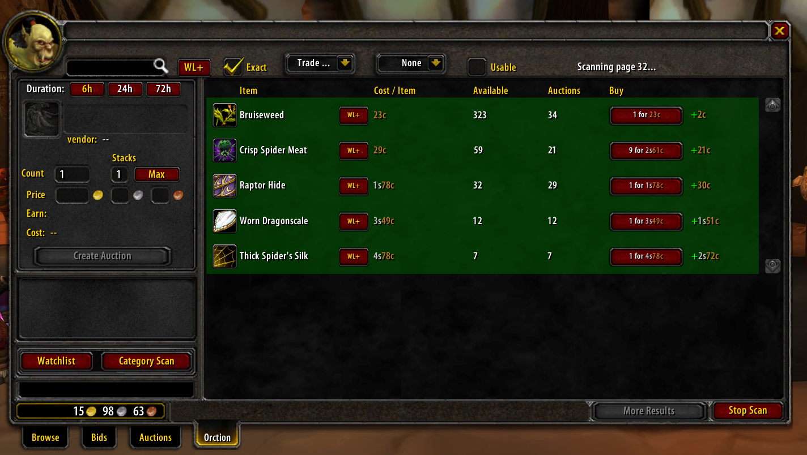
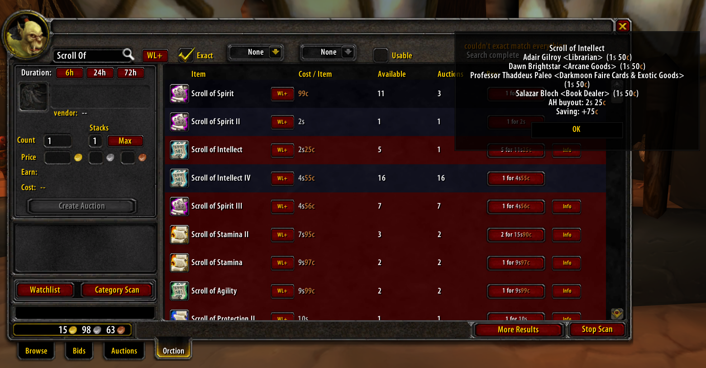

# Orction

A World of Warcraft auction house addon for **Vanilla 1.12 / TurtleWoW** that adds market analysis, smart auction posting, and inventory tools — all integrated directly into Blizzard's native auction house UI.

---

## Features

### Market Analysis
- **7-Day Price History**: Tracks auction prices across a rolling 7-day window with per-realm and per-faction storage
- **Confidence Scoring**: Price bars reflect how many observations back the data — low-count days appear muted, full confidence at 20+ observations
- **Rolling Averages**: Computes weighted average prices across the history window
- **Vendor Profit Detection**: Automatically highlights items selling below vendor price in green during scans and searches

### Item Search
- **Flexible Search**: Search by name with category and item class/subclass filtering
- **Usable-Only Filter**: Restrict results to items your character can equip or use
- **Paginated Results**: Configurable page limit prevents the UI from being overwhelmed on popular items
- **Result Table**: Shows item name, quantity, cost per item, total cost, and buyout — with vendor comparison inline

### Auction Posting
- **Drag-and-Drop Input**: Drop items from your bags directly into the post UI
- **Smart Pricing**:
  - Undercuts existing listings by ~0.5%
  - Falls back to a configurable vendor price multiplier when no market data exists
  - Warns visually if you're about to post below vendor value
- **Multi-Stack Support**: Automatically splits large quantities into multiple auctions at the configured stack size
- **Duration Options**: 12h, 24h, or 48h — synced from settings
- **Deposit Preview**: Real-time deposit cost calculation before posting

### Scanning
- **Category Scans**: Scan entire item categories and aggregate all results into one table
- **Watchlist Scanning**: Queue a list of saved items and scan them sequentially
- **Progress Display**: Live page counter with "Scan Complete" notification
- **Rate Limiting**: Built-in inter-query delays and retry logic to handle server throttling

### Vendor Price Integration
- **Static Vendor Database**: 500+ items with known vendor prices
- **Intelligent Caching**: Stores lookup results by item name and item ID to avoid redundant bag scans
- **Informant Addon Support**: Automatically imports vendor buy prices and merchant data from Informant if installed
- **Merchant Tracking**: Records which NPCs sell specific items for profit calculations

### Tooltip Enhancements
- **Vendor Price on Hover**: Shows vendor sell price and total stack value when hovering bag items
- **Embedded Price Graph**: 7-day price trend graph shown directly in item tooltips
- **Today Highlighting**: Today's bar is gold-bordered for quick orientation
- **Graceful Fallback**: Works cleanly when optional dependencies aren't loaded

### Postal Helper
- **Batch Mail Opening**: "Open All at Once" button to collect all mailbox items in sequence
- **Money Display**: Shows gold amounts on mail rows with standard WoW color formatting
- **Item Count Display**: Stack quantities shown on mail item icons
- **Configurable Delays**: Adjust inter-mail delays and retry counts for server responsiveness

### Data Sync
- **Guild/Raid/Party Sharing**: Broadcasts price observations to guild, raid, or party chat via addon messages
- **Rate-Limited Queue**: Sends data at 0.5s intervals to avoid chat spam
- **Realm & Faction Tagging**: All messages are scoped to realm and faction
- **Self-Filter**: Ignores your own rebroadcasted messages

### Watchlist
- **Persistent Watchlist**: Save frequently searched items for one-click re-search
- **Add/Remove Controls**: Manage the list directly from the search UI

### Settings
- **`/orction` Command**: Opens a tabbed settings window
- **Per-Feature Toggles**: Enable or disable auction, posting, inventory, data, and sync features independently
- **Slider Controls**: Adjust numeric settings like max scan pages and vendor price multiplier
- **Draggable Window**: Move the settings dialog anywhere on screen

---

## Installation

1. Download or clone this repository
2. Copy the `orction` folder into your `Interface/AddOns/` directory
3. Restart WoW or reload your UI (`/reload`)
4. Open the Auction House — an **Orction** tab will appear alongside the native Browse/Bid/Auctions tabs

---

## Optional Dependencies

| Addon | Benefit |
|-------|---------|
| **Informant** | Imports vendor buy prices and merchant data for more accurate profit calculations |

---

## Commands

| Command | Action |
|---------|--------|
| `/orction` | Open the settings window |

---

## File Overview

| File | Purpose |
|------|---------|
| `Orction.lua` | Main UI, search, posting, scanning, buying |
| `OrctionSettings.lua` | Settings window |
| `Database.lua` | Vendor price database and money formatting |
| `DataManagement.lua` | 7-day rolling price history |
| `OrctionVendor.lua` | Vendor price lookups and caching |
| `OrctionBarGraph.lua` | Bar graph widget for price visualization |
| `OrctionSync.lua` | Guild/raid/party price data sharing |
| `OrctionPostbox.lua` | Mailbox batch open UI |
| `OrctionTooltip.lua` | Item tooltip hooks |
| `OrctionInformantImport.lua` | Informant data import on startup |

---

## Compatibility

- **Interface**: 11200 (Vanilla 1.12 / TurtleWoW)
- **Language**: Lua 5.0
- **SavedVariables**: `OrctionDB`
